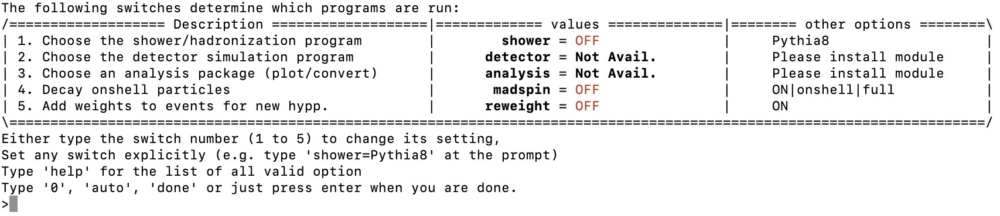
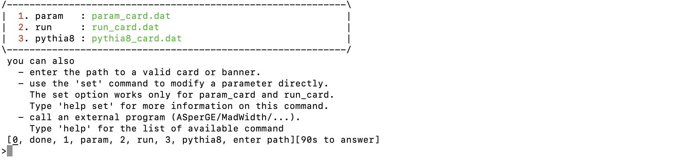
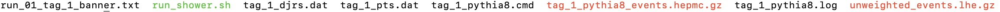

# MadGraph5_aMC@NLO

## Introduction
A vital part of any physics analysis is making predictions to compare measurements with. Predictions in High Energy Physics(HEP) are often generated by a chain of complex processes which each have their own dedicated tool. In the LHC HEP community we often categorize the predictions into parton, particle and detector level. Parton level constitutes predictions of particle collision event observables before hadronisation i.e. before the formation of stable particles (\(\tau > 30 ps\)) such as electrons or hadrons. Particle level constitutes predictions after hadronization but before interaction with the detector and detector level deals with predictions including the detector response. In this tutorial it is shown how to use MadGraph5_aMC@NLO(MG) to calculate matrix elements, total(inclusive) cross-sections and generate events. It should be noted that there are other event generator packages out there such as PowhegBox or Sherpa that are used within the HEP community. These will not be covered in this tutorial.

## Goals
At the end of this tutorial you will be able to:

- Setup MadGraph5_aMC@NLO
- Calculate total(inclusive) cross sections
- Generate events (parton level)
- Shower the events (particle level)

One should note that MC samples used in ATLAS publications are requested via an official channel. Different dedicated tutorials will discuss how to put in such a request and how to analyze the output formats that come with it.

## Installation
One can get the MG software either via two ways:

- Download and unpack a tarball-file from the website [launchpad.net/mg5amcnlo/downloads](https://launchpad.net/mg5amcnlo/+download)
- Pull a branch with bazaar. All the branches are listed on their website [launchpad.net/mg5amcnlo/code](https://code.launchpad.net/mg5amcnlo)

There are only a select few MG versions available in tarball-file. If one has bazaar installed on their machine it is possible to pull any branch, development or official release, listed in the page above. For all branches the only prerequisite software one needs is Python 2.6 or 2.7.

## Support
MG has a dedicated forum [launchpad.net/mg5amcnlo/answers](https://answers.launchpad.net/mg5amcnlo) for technical questions which the developers maintain actively. Many issues a novice user might encounter are often already covered in a post on the forum. However, the developers often answer any new questions within a couple of days.

## Running MG
After navigating to the downloaded MG directory one can run MG with the command

```
./bin/mg5_aMC
```
or
```
python ./bin/mg5_aMC 
```
depending on your MG version. This opens an interactive shell with specific MG commands to setup your calculations.

## UFO models
UFO is a format that dictates the Feynman rules of a QFT. These files are used as input for MC generators, not just MG, and can model anything from SM to SUSY, EFT or 2HDM. All of the models are kept in a database [feynrules.ucl.ac.be/UFOmodels](http://feynrules.irmp.ucl.ac.be/wiki/ModelDatabaseMainPage) where each model page gives the authors and describes the model in terms of symmetries, operators, parameters, coupling orders and more. The default model is SM but one can easily download and access a model within the interactive shell of MG with the command

```
import model SMEFTatNLO
```

Here SMEFTatNLO is the model name, an effective field theory in this case. Look at the model pages on the website above for similar commands for other models.

## Define your process
After defining the model one can define the physics process one wants to calculate predictions for. Lets produce \(t\bar{t}\) samples as an example. One starts with the following command

```
generate p p > t t~ QED=0 QCD=2 NP=2 [QCD]
```
Now there are several things going on here so lets break them down. The definition of a physics process always starts with the command ``` generate ```. After that we define two protons ``` p p ``` as incoming particles. These are actually defined as a multiparticle of many quarks and gluons. Use the command ``` display particles ``` and ``` display multiparticles ``` to show all the fundamental and composite particles defined in your model. It is also possible to define your own multiparticle like
```
define wmp = w+ w-
```
Here we defined a particle that can either take part in the process as a \(W^{+}\) or a \(W^{-}\)-boson. This is very practical in cases where one wants to include two proceses that only differ in the \(W^{\pm}\)-boson eg. a Higgs produced in association with a W boson ``` p p > wmp h ```. After the ``` > ``` the outgoing particles are defined, a top quark ``` t ``` and an anti-top quark ``` t~ ```. After that one defines the orders of the couplings i.e. ``` QCD=2 ``` notes that up to second order QCD couplings need to be taken into account, ```QED=0``` no non-QCD orders and ```NP=2``` up to second order new physics couplings. The latter is specific for the SMEFTatNLO model as it introduces new couplings in addition to the SM QED and QCD couplings. The ``` [QCD] ``` command flags that we want to do next-to-leading order(NLO) calculations. One can perform leading order(LO) calculations by simply leaving this flag out. It is possible to add a process with the following command

```
add process p p > t W- $$ t~ QED=1 QCD=1 NP=2 [QCD]
```
Here ```$$ t~``` exludes any \(s\)-channel diagrams that contain a ```t~```. One can display all the included diagrams with
```
display diagrams
```
Additionally, one can define decay chains.
```
generate p p > t t~,(t > W+ b, W+ > j j), (t~ > W- b~, W- > l- vl~)
```
Here one adds a semi-leptonic decay chain to the \(t\bar{t}\) process. As last step one can define an output directory where all the code will be compiled and output files saved.
```
output output_dir/specified/by/you
```
Then one can launch the simulation with the command
```
launch
```
## Leading Order calculations
Lets assume we defined the following leading order process
```
generate p p > t t~ QED=0 QCD=2
```
After the ```launch``` command one gets the following options



Here there are several options to set:

- Shower/Hadronization program. Switch this on to shower the generated events with programs such as Pythia or Herwig.
- Choose detector simulation. If one choose a hadronization program then it is possible to add detector simulation eg. with Delphes.
- Choose an analysis package. Here one can fill histograms on the fly when generating events eg. with MadAnalysis.
- Decay onshell particles. One can decay the particles with an additional module called MadSpin. This module can include more information such as spin correlations or off-shell effects.
- Add weights to events for reweighting. This allows the user to reweight the events of the sample according to some parameter change eg. if one wants to change the top mass of a fully simulated sample ata later moment.

After specifying these options one continues the next set of options



The ```param_card.dat``` specifies parameters such as particle masses, coupling strengths and decay widths. This will depend on the model loaded earlier i.e. SMEFTatNLO in this case. The ```run_card.dat``` specifies things like the number of events, cuts, PDF set and beam energy. If one choose a hadronization program, eg. pythia8, one can specify hadronization options in ```pythia8_card.dat```. After setting these final options one can run the event generation. The output can be found in the previously defined output directory in the Events/run_01 subdirectory.



The generated events are saved in the compressed LHE-file ```unweighted_events.lhe.gz``` and the hadronized events in the compressed HEPMC-file ```tag_1_pythia8_events.hepmc.gz```.

## References

- Main reference for MadGraph [Arxiv:1405.0301](https://arxiv.org/pdf/1405.0301.pdf). This contains the theoretical description of MadGraph, instructions how to run MadGraph and example results. See the tables in the back of the paper for syntax examples of many processes.
- MadGraph Tutorials by [O. Mattelaer](http://www.physics.ntua.gr/corfu2017/Talks/olivier_mattelaer@uclouvain_be_01.pdf), [Z. Wang](https://twiki.cern.ch/twiki/bin/view/CMSPublic/MadgraphTutorial) and [University of Shanghai(SJTU)](https://www.physics.sjtu.edu.cn/madgraphschool/sites/www.physics.sjtu.edu.cn.madgraphschool/files/Tutorial_shangai_basic_mg5.pdf)
